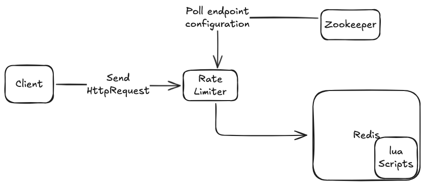

## Architecture

This is a Java-based system that throttles HTTP requests using configurable rate-limiting algorithms.

The system consists of three primary components:

- **ZooKeeper** – configuration registry
- **Redis** – distributed rate-limit state store
- **Rate Limiter** – request interception and throttling engine

### Configuration (ZooKeeper)

ZooKeeper acts as the configuration registry for the system.  
For each endpoint, it stores:

- the rate-limiting algorithm (e.g. token bucket)
- algorithm-specific parameters such as:
    - refill rate
    - bucket capacity
    - refill interval
    - request cost

Configurations are organized by endpoint and loaded by the rate limiter at startup.  
The rate limiter **watches ZooKeeper for configuration changes**, allowing rate-limit rules to be updated dynamically without restarting the service.

### Request Processing (Rate Limiter)

The rate limiter sits in the request path and intercepts incoming HTTP requests.

For each request:
1. A connection is established to the upstream server socket.
2. The request is streamed (request line, headers, and body).
3. A rate-limit key is derived from attributes such as:
    - session ID (from cookies)
    - target endpoint
4. The rate limiter queries Redis to evaluate whether the request exceeds the permitted quota.
5. If the request is allowed, it is forwarded to the upstream service.
6. If the quota is exceeded, a `429 Too Many Requests` response is returned to the client.

### Rate-Limit State (Redis)

Redis stores the **rate-limiting state** for each `(session, endpoint)` pair.

The state includes:
- current token count
- last refill timestamp

All rate-limit operations are performed using **Lua scripts** executed on the Redis server.  
This ensures:
- atomic updates under concurrent access
- consistent behavior across multiple rate-limiter instances
- reduced network round-trips, since computation and persistence occur server-side

### Architecture Overview

## Design Decisions

- Redis + Lua was chosen to guarantee atomic rate-limit state updates under high concurrency.
- ZooKeeper is used only for configuration, keeping request-time dependencies minimal.
- Rate-limit keys are derived from session ID and endpoint to ensure fairness across users.

## Future Considerations
- Provide implementation for other algorithms such as leaking bucket etc.
- Scale each of the components. 
- Add end-to-end tests and performance benchmarking. 
